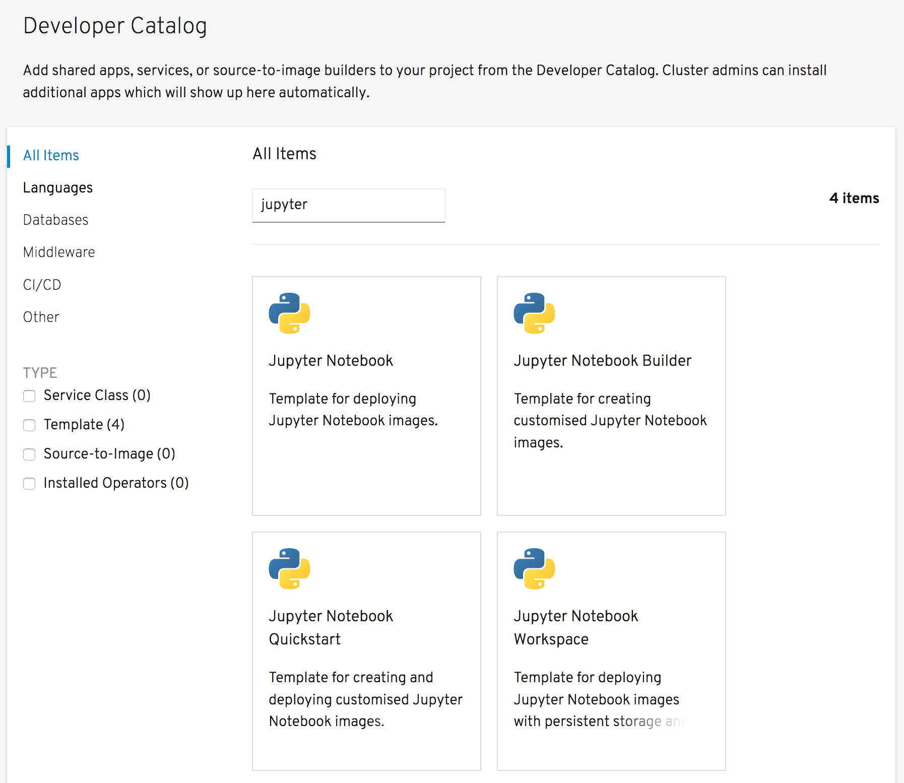

In the separate workshop _Deploying a Jupyter Notebook Image_ we already saw how the `notebook-deployer` template could be used to deploy an instance of a Jupyter notebook environment. This environment was empty and you would have needed to upload any existing notebooks you wanted to use, as well as manually install into the environment any additional Python packages required by the notebooks.

In this workshop we are going to create a custom Jupyter notebook image which includes any notebook files you require, as well as having any Python packages they need already installed. The result is a container image that can be redistributed and made available to others, or, using the same process as will be shown, someone else could build their own container image from your original files. Once the custom Jupyter notebook image has been created, we will deploy it.

From the options for deploying applications to your project, select _From Catalog_. This will bring up the _Developer Catalog_.

Ensure that _All Items_ is selected on the left hand size, and in the _Filter by keyword_ text entry field enter ``jupyter``{{copy}}. This will limit the displayed items to just the OpenShift templates you loaded.

Click on the tile for _Jupyter Notebook Builder_.

This will bring up the description of the template. Click on _Instantiate Template_, which will bring up a form with the parameters for the template which you can customize.
