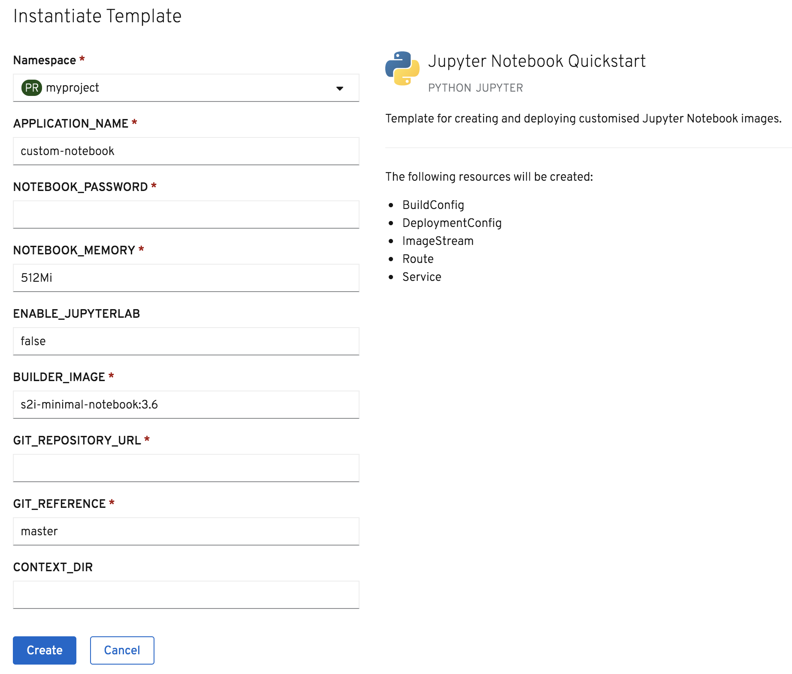

Having built a custom Jupyter notebook image as a separate step, you can deploy as many separate instances as you need to. You just need to name each deployment differently.

If you don't need to deploy multiple Jupyter notebook instances from the same image, or you are in a hurry, you can build the custom image and deploy it in one step using the `notebook-quickstart` template.

Return back to the web console again, and click on the _+Add_ option in the left hand side menu bar if necessary to bring up the page of options for deploying applications to your project.

Select _From Catalog_. This will bring up the _Developer Catalog_.

Ensure that _All Items_ is selected on the left hand size, and in the _Filter by keyword_ text entry field enter ``jupyter``{{copy}}.

This time click on the _Jupyter Notebook Quickstart_ tile.

This will bring up the description of the template. Click on _Instantiate Template_, which will bring up a form with the parameters for the template which you can customize.

The purpose of the template parameters are:

* ``APPLICATION_NAME`` - The name of the deployment.
* ``NOTEBOOK_PASSWORD`` - The password used to protect access to the Jupyter notebook. This cannot be left empty.
* ``NOTEBOOK_MEMORY`` - The maximum amount of memory the Jupyter noteboook deployment is allowed to use.
* ``ENABLE_JUPYTERLAB`` - Whether the JupyterLab web interface, rather than the classic web interface, is enabled.
* ``GIT_REPOSITORY_URL`` - The URL to a hosted Git repository containing the Jupyter notebook files, and a Python ``requirements.txt`` file listing any Python packages required by the notebook files.
* ``GIT_REFERENCE`` - The branch of the Git repository to use.
* ``CONTEXT_DIR`` - Where files to be used to build the custom notebook image are located in a sub directory of the Git repository, the name of that sub directory.

You can see that with this template it combines template options required for building a custom Jupyter notebook image with those for deploying it.

In the ``NOTEBOOK_PASSWORD`` field enter a password of ``secret``{{copy}}.

In the ``GIT_REPOSITORY_URL`` field enter the URL:

``https://github.com/jupyter-on-openshift/sample-notebooks``{{copy}}

In the ``CONTEXT_DIR`` field enter:

``matplotlib``{{copy}}

Click on _Create_ to instantiate the template. This will leave you on the _Template Instance Overview_ with details of what was created.

To monitor the building of the custom notebook image, run:

``oc logs -f bc/custom-notebook``{{execute}}

To monitor the deployment, click on the _Topology_ view in the left hand side menu.

Once the ring has turned blue indicating the application is running, click on the icon for accessing the application via its URL.

Accept the certificate for the secure connection and enter ``secret``{{copy}} for the notebook password, in order to access the Jupyter notebook web interface.
