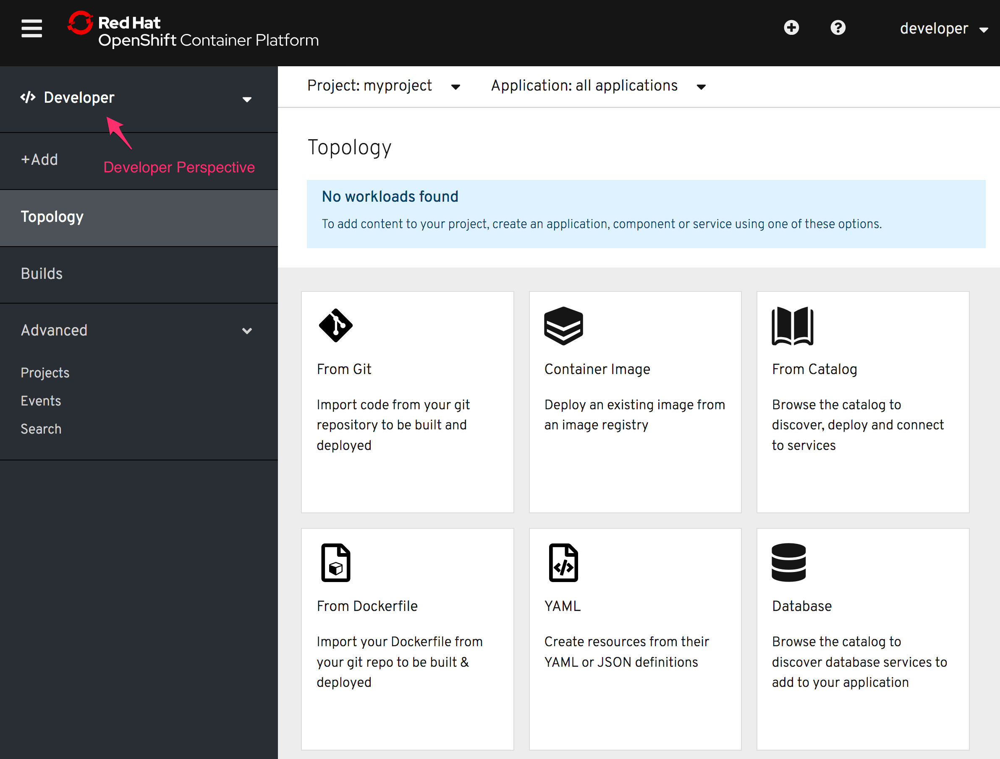

To deploy a Jupyter notebook using the `notebook-deployer` template, you can use the command line or the OpenShift web console. We will use the web console in this example.

Click on the _Console_ tab in the workshop dashboard. You will be presented with the OpenShift login screen.

For the credentials, enter:

* **Username:** ``developer``{{copy}}
* **Password:** ``developer``{{copy}}

As you have already created a project to use for this workshop, you will be presented with a list of the projects you have available.

Click on ``myproject`` and you should then be at the _Overview_ page for
the project. Select the _Developer_ perspective for the project instead of the _Adminstrator_ perspective in the left hand side menu. If necessary click on the hamburger menu icon top left of the web console to expose the left hand side menu.

As the project is currently empty, no workloads should be found and you will be presented with various options for how you can deploy an application.

