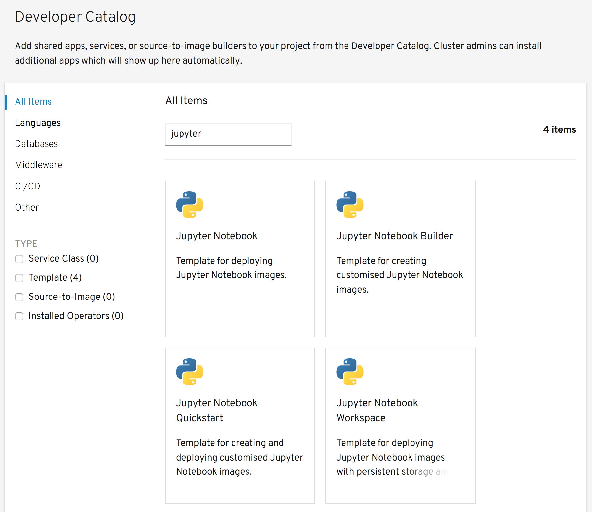

From the options for deploying applications to your project, select _From Catalog_. This will bring up the _Developer Catalog_.

Ensure that _All Items_ is selected on the left hand size, and in the _Filter by keyword_ text entry field enter ``jupyter``{{copy}}. This will limit the displayed items to just the OpenShift templates you loaded.

Click on the tile for _Jupyter Notebook_.

This will bring up the description of the template. Click on _Instantiate Template_.
