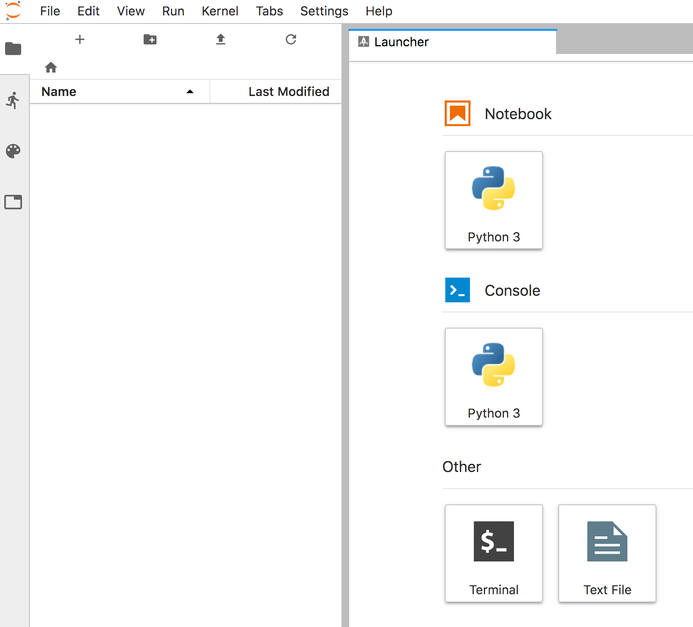

By default the Jupyter notebook instance will use the classic notebook web interface. If you instead want to enable the newer JupyterLab web interface, when creating the Jupyter notebook deployment using the template, you can set the ``ENABLE_JUPYTERLAB`` template parameter to ``true`` instead of ``false``.

If you forgot to do this when your create the deployment, you can switch to the JupyterLab interface by editing the deployment configuration from the web console and changing the value of the ``JUPYTER_ENABLE_LAB`` environment variable from ``false`` to ``true``. Updating the environment variable in the deployment configuration will trigger a restart of the Jupyter notebook instance, so heed the prior warning about loosing any work when not using a persistent workspace.

Changing the value of the environment variable can also be done from the command line. For the sample deployment you created in this exercise, you can do this by running:

``oc set env dc/custom-notebook JUPYTER_ENABLE_LAB=true``{{execute}}

Monitor the deployment to see when the Jupyter notebook instance has restarted, by running:

``oc rollout status dc/custom-notebook``{{execute}}

Return to the _Console_ and go to the _Topology_ view. Click on the icon for the URL to bring up the Jupyter notebook web interface.

You will be prompted to login to the Jupyter notebook instance again. Supply the password ``secret`` from before. You should now see that the JupyterLab web interface is being used.

