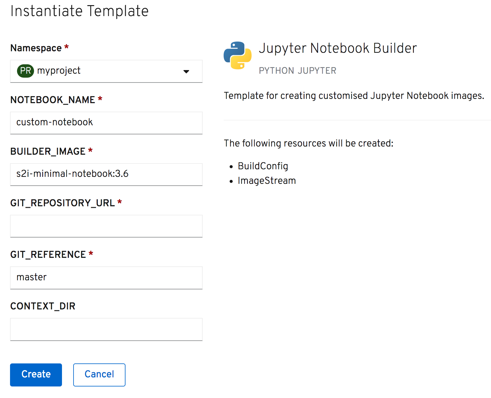

In the separate workshop _Deploying a Jupyter Notebook Image_ we already saw how the `notebook-deployer` template could be used to deploy an instance of a Jupyter notebook environment. This environment was empty and you would have needed to upload any existing notebooks you wanted to use, as well as manually install into the environment any additional Python packages required by the notebooks.

In this workshop we are going to create a custom Jupyter notebook image which includes any notebook files you require, as well as having any Python packages they need already installed. The result is a container image that can be redistributed and made available to others, or, using the same process as will be shown, someone else could build their own container image from your original files. Once the custom Jupyter notebook image has been created, we will deploy it.

From the options for deploying applications to your project, select _From Catalog_. This will bring up the _Developer Catalog_.

Ensure that _All Items_ is selected on the left hand size, and in the _Filter by keyword_ text entry field enter ``jupyter``{{copy}}. This will limit the displayed items to just the OpenShift templates you loaded.

Click on the tile for _Jupyter Notebook Builder_.

This will bring up the description of the template. Click on _Instantiate Template_, which will bring up a form with the parameters for the template which you can customize.

The purpose of the template parameters are:

* ``NOTEBOOK_NAME`` - The name to be given to the custom notebook image.
* ``BUILDER_IMAGE`` - The name and version of the Jupyter notebook image to be used as the base for building the custom notebook image.
* ``GIT_REPOSITORY_URL`` - The URL to a hosted Git repository containing the Jupyter notebook files, and a Python ``requirements.txt`` file listing any Python packages required by the notebook files.
* ``GIT_REFERENCE`` - The branch of the Git repository to use.
* ``CONTEXT_DIR`` - Where files to be used to build the custom notebook image are located in a sub directory of the Git repository, the name of that sub directory.

In the ``GIT_REPOSITORY_URL`` field enter the URL:

``https://github.com/jupyter-on-openshift/sample-notebooks``{{copy}}

In the ``CONTEXT_DIR`` field enter:

``matplotlib``{{copy}}

Click on _Create_ to instantiate the template. This will leave you on the _Template Instance Overview_ with details of what was created.

Usually a template is used to create a deployment for an application. In this case it has created a build configuration and triggered a build of a custom notebook image, using the files held in the Git repository you provided to the template.

To monitor the building of the custom notebook image, run:

``oc logs -f bc/custom-notebook``{{execute}}

The build may take a few moments to start as it pulls down the builder image to use.

The build process will then use the builder image as a base for your custom notebook image, injecting into the image the source code files from the Git repository, and installing and Python packages listed in the Python ``requirements.txt`` file.

One of the items created by the template is an image stream, with it defining the destination for the image which is built.

List the image streams in the project by running:

``oc get imagestreams -o name``{{execute}}

You will see there are now two image streams, the `s2i-minimal-notebook` which was used as the builder image, and the the `custom-notebook` image, which was created by the build.
