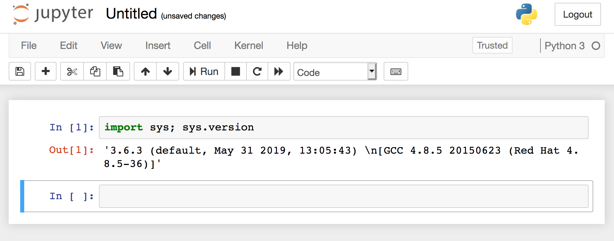

To test that the persistent storage is working as advertised, create a new notebook file by clicking on _New_ in the Jupyter notebook file browser and select _Python 3_.

This will open a new browser tab or window. Enter into the first cell:

``import sys; sys.version``{{copy}}

and press SHIFT-ENTER. This should execute the cell and you should see output similar to:

The notebook file should be perioically saved, but to be sure, click on the save icon in the upper left and close the browser tab or window. Back in the Jupyter notebook file browser window, you should see the notebook file as ``Untitled.ipynb``.

Close the browser tab or window for the Jupyter notebook file browser as well.

Although we have closed the Jupyter notebook, it is still running. You can see the running Kubernetes pod it by running:

``oc get pods -l app=custom-notebook``{{execute}}

To kill the pod and cause a restart of Jupyter notebook instance run:

``oc rollout latest dc/custom-notebook``{{execute}}

To see when the re-deployment has completed, run:

``oc rollout status dc/custom-notebook``{{execute}}

This command should only return when the Jupyter notebook instance is running again.

Return to the _Topology_ view in the web console and click on the short cut icon for accessing the application via its public URL.

You will be access to login again. Use ``secret``{{copy}} as the password.

Once access is granted, you should see that the notebook file you created is still present.

To check that it is a different instance of the Jupyter notebook application, run:

``oc get pods -l app=custom-notebook``{{execute}}

The pod name should be different.

If you created a _Terminal_ from the _New_ menu and had manually installed any Python packages, or had installed them through actions in the notebook file, these Python packages should also still exist after the restart.

The ``jupyter-workspace`` template therefore gives you a persistent workspace in which to work on your Jupyter notebook files, knowing that you will not loose your work.
